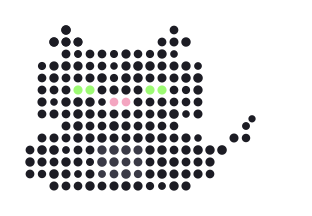

# kuudaru

個人開発エンジニアとしての発信用ハンドル。Web ディレクション × メディアアート × セルフホスト基盤いじりが好きです。

 

 

## About

- 🖥️ Web ディレクター。GA4/GTM やアクセシビリティ（JIS X 8341-3）まわりを見つつ、外部の実装パートナーと連携する仕事をしています
- 🎨 メディアアート制作もするので「見えないもの・ブラックボックス化されたもの」への関心を、作品づくりとコードの両方に持ち込んでいます
- 🏠 自宅に Mac mini / Synology NAS / Docker / Cloudflare Tunnel を組んだホームラボがあり、常時いじっています
- 🌱 現在は CLI をスラスラ書けるようになるのを目標に、Git・テキスト処理・Linux サーバー運用まわりを学習中です

## Currently building

| Project | Stack | 概要 |
|---|---|---|
| **kuu** (portfolio) | Astro (EmDash CMS) / Cloudflare Workers + D1 + R2 | メディアアート作品と開発記録を公開するポートフォリオサイト |
| **議事録アプリ** | macOS native / on-device + API summarization | リアルタイム文字起こし＋要約のネイティブ議事録アプリ |
| **Morning Digest** | GitHub Actions / Cloudflare Pages / Gemini API | メディアアート・AI の記事を毎朝まとめて読むための限定公開サイト |
| **Homelab** | n8n → OpenClaw / Cloudflare Zero Trust / Tailscale | 自宅サーバーのゼロトラスト化と個人 AI アシスタントの常時稼働環境づくり |

## GitHub stats

 

🐈‍⬛ この子はページの中でずっと動いています（まばたき・耳・しっぽ） / this cat keeps blinking, twitching its ears, and swishing its tail right here on the page.

